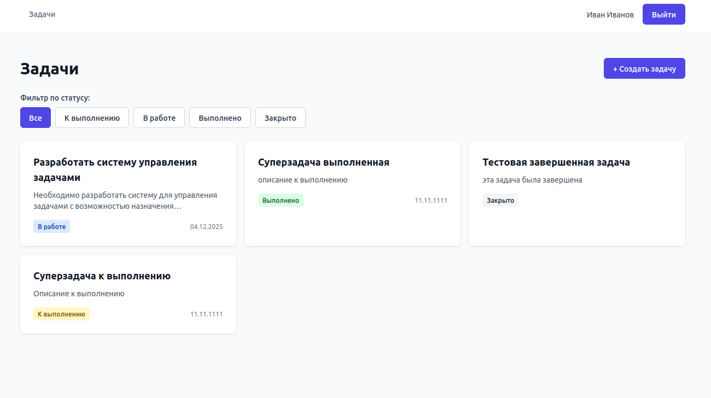
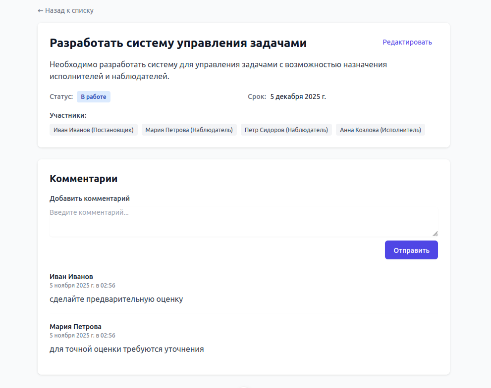
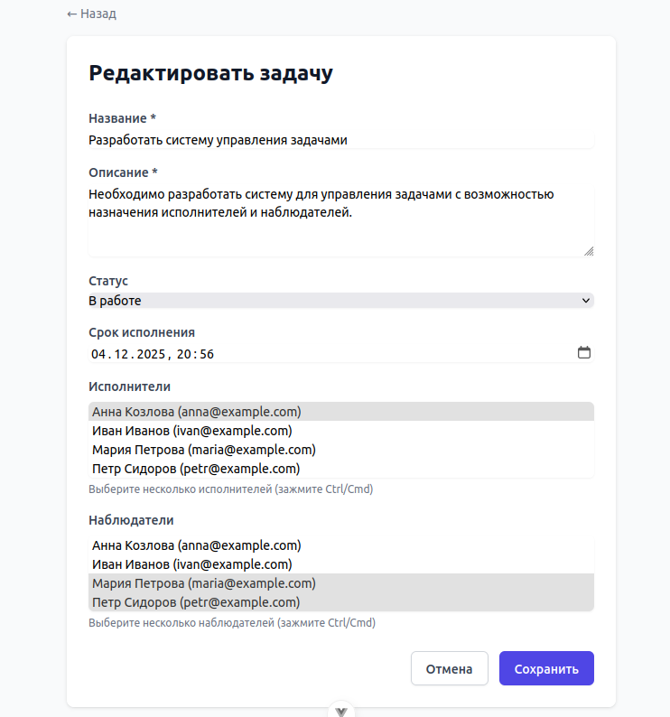

# 📋 Система управления задачами (Kanban)

## ✅ Техническое задание

### Требования:

- Laravel 12 API с аутентификацией (Sanctum)
- Эндпоинты:
    - Регистрация, авторизация пользователя
    - CRUD для задач (create, read, update, delete)
        - Список задач
            - Фильтрация по статусу задачи
    - CRUD для комментариев к задаче
- Vue 3 SPA с Composition API
- Запуск приложения в докер одной командой `docker compose up -d`

**Система должна уметь:**
    - Регистрировать и авторизировать пользователя
    - Управлять задачами (create, read, update, delete)
    - Задача должна иметь след. атрибуты:
        - Наименование
        - Содержание задачи
        - Статус
        - Срок исполнения
        - Постановщик
        - Исполнитель
        - Список участников (Постановщик/Исполнитель/Наблюдатель)
    - Задача не доступна пользователю, если он не в списке участников

**Если в условиях вам не хватает каких-то данных, опирайтесь на здравый смысл.**
    - Умение принимать решения
    - Умение аргументировать выбранные решения

---

## 🚀 Описание приложения

Система управления задачами (Kanban) — это полнофункциональное веб-приложение для управления задачами с разделением ролей участников. Приложение реализовано как SPA (Single Page Application) с раздельной архитектурой: backend на Laravel 12 и frontend на Vue 3.

### Основной функционал:

- **Аутентификация и авторизация**: Регистрация, вход/выход через Laravel Sanctum
- **Управление задачами**: 
  - Создание, просмотр, редактирование и удаление задач
  - Фильтрация задач по статусу (todo, in_progress, done, closed)
  - Назначение исполнителей и наблюдателей
  - Установка срока исполнения
- **Комментарии**: Добавление комментариев к задачам
- **Контроль доступа**: Задачи доступны только участникам (создателю, исполнителю, наблюдателю)

### Архитектура:

- **Backend**: RESTful API на Laravel 12
- **Frontend**: Vue 3 SPA с Composition API
- **Контейнеризация**: Docker Compose для запуска всех сервисов
- **База данных**: PostgreSQL 13
- **Кэширование**: Redis

---

## 🛠 Используемые технологии

### Backend:
- **Laravel 12** — PHP фреймворк
- **Laravel Sanctum** — аутентификация через API токены
- **PostgreSQL 13** — реляционная база данных
- **Redis** — кэширование и сессии
- **Nginx** — веб-сервер
- **PHP 8.2+** — язык программирования

### Frontend:
- **Vue 3** — JavaScript фреймворк (Composition API)
- **TypeScript** — типизация JavaScript
- **Vite 7** — сборщик и dev-сервер
- **Vue Router 4** — маршрутизация SPA
- **Pinia 3** — управление состоянием
- **Axios** — HTTP клиент для API запросов
- **Tailwind CSS 3** — utility-first CSS фреймворк

### Инфраструктура:
- **Docker & Docker Compose** — контейнеризация
- **Node.js LTS** — среда выполнения для Vue
- **Nginx** — reverse proxy и веб-сервер

### Архитектурные паттерны и подходы:
- **Repository Pattern** — абстракция доступа к данным
- **Service Layer** — бизнес-логика и проверка доступа
- **State Machine** — управление статусами задач (todo → in_progress → done → closed)
- **RESTful API** — стандартизированные эндпоинты

---

## 📸 Скриншоты приложения

### Главная страница со списком задач



Описание: Главная страница приложения со списком всех задач пользователя. Видны фильтры по статусам (Все, Todo, In Progress, Done, Closed) и карточки задач с основной информацией.

---

### Страница детального просмотра задачи



Описание: Страница с полной информацией о задаче: название, описание, статус, срок исполнения, список участников (создатель, исполнители, наблюдатели) и комментарии.

---

### Форма создания/редактирования задачи



Описание: Форма для создания или редактирования задачи. Поля: название, описание, статус, срок исполнения, выбор исполнителей и наблюдателей из списка пользователей.

---

### Анимация работы приложения


Описание: GIF-демонстрация основных функций приложения: регистрация, вход, создание задачи, фильтрация, просмотр деталей, добавление комментариев.

---

## 🚀 Быстрый старт

```bash
# Запуск всех сервисов
docker compose up -d

# Применение миграций и сидеров (первые раз)
docker compose exec php php artisan migrate:fresh --seed
```
**Что создается сидерами:**
- **5 пользователей** (все с паролем `password`):
  - Иван Иванов - `ivan@example.com` / `password`
  - Мария Петрова - `maria@example.com` / `password`
  - Петр Сидоров - `petr@example.com` / `password`
  - Анна Козлова - `anna@example.com` / `password`
  - Сергей Волков - `sergey@example.com` / `password`
- **4 задачи** с разными статусами: и участниками
- **2 комментария** к первой задаче от разных пользователей


**Доступ:**
- Frontend: http://localhost:5173
- Backend API: http://localhost:8080/api